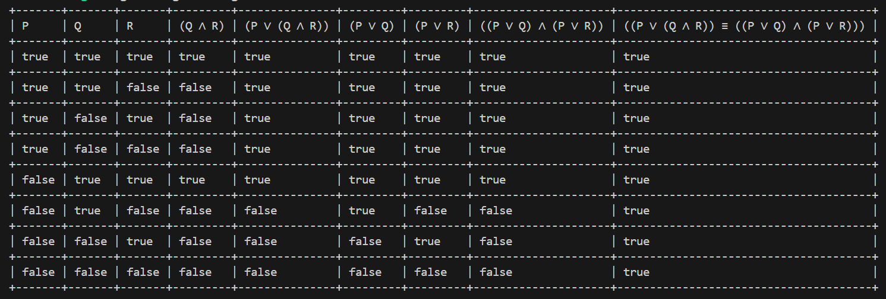
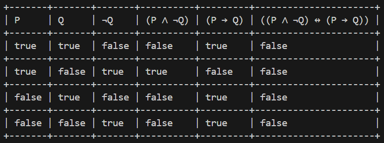
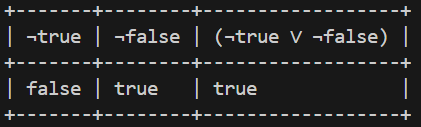

# Propositional logic evalutaor.
Supported operators and symbols:
- Not: `not`, `¬`, `!`, `∼`
- And: `and`, `&`, `&&`, `∧`
- Or: `or`, `|`, `||`, `∨`
- XOr: `xor`, `⊕`
- Implication: `->`, `=>`, `⇒`, `→`, `⊃`
- Biconditional: `<->`, `<=>`, `⇔`, `↔`, `iff`, `xnor`
- Logical equivalence: `=`, `==`, `eq`, `≡`
- Not equal: `!=`, `≠`
- parentheses: `()`, `{}`, `[]`
- True: `1`, `true`, `True`
- False: `0`, `false`, `False`

**Note**: `Logical equivalence` means there is a proof for `Biconditional` expression. for example:</br>
$(P↔Q) ≡ (P→Q)∧(Q→P)$ means you can prove $(P↔Q) ↔ (P→Q)∧(Q→P)$ or prove both $(P↔Q)→(P→Q)∧(Q→P)$ and $(P→Q)∧(Q→P)→(P↔Q)$. Therefore, the truth table for `≡` results in all true. but for `↔`, all result to true if it is proofable.</br>

**Note**: the order of evaluation of operators are: `not`, `and`, `or`, `xor`, `→`, `↔`, `≡` and `≠`. Please use parentheses in order to adjust the operator priorities. incorrect expressions result in wrong tables.</br>

**Note**: Characters are case sensetive. for example `q` is not the same as `Q`.

Example: </br>
- Truth table for `P ∨ (Q ∧ R) ≡ (P ∨ Q) ∧ (P ∨ R)` or `P or (Q and R) == (P or Q) and (P or R)`



- Truth table for `(P ∧ (∼ Q)) ⇔ (P ⇒ Q)` or `(P and (not Q) <-> (P -> Q))`



- Truth table for `not true or not false`



# How to run
1. install `rust`. see [here](https://www.rust-lang.org/tools/install) for the instructions.
2. run `cargo run` to run the app.
3. run `cargo test` to run the tests.

# How to use
You can export the truth tables to one of the following formats or print it to terminal.
- csv
- html
- pdf (does not support displaying some characters)

```rust
    let s = "(P and not Q) <-> (P -> Q)";//"(P ∧ (∼ Q)) ⇔ (P ⇒ Q)";
    let tokens = Tokens::from_text(s);
    match Evaluator::new(tokens) {
        Ok(evaluator) => {
            match evaluator.evaluate_all() {
                Ok(result) => {
                    print!("{}\n",result);
                    // result.save_to_html("test.html");
                    // result.save_to_csv("test.csv");
                    // result.save_to_pdf("test.pdf");
                },
                Err(error) => {
                    println!("{}",error);
                },
            }
        },
        Err(er) => {
            println!("{}",er);
        },
    }
```

Or you can evaluate for specific values only.

```rust
    let s = "(∼ P) ∨ (∼ Q)";
    let tokens = Tokens::from_text(s);
    let evaluator = Evaluator::new(tokens).unwrap();
    let mut values = IndexMap::<char,bool>::new();
    values.insert('P', false);
    values.insert('Q', true);
    let mut result = evaluator.evaluate(&values).unwrap();
    for v in values.iter().rev() {
        result.insert_before(0, (*v.0).into(), *v.1);
    }
    let result = evaluator_result::EvaluatorResult{result:vec![result]};
    println!("{}",result);
    // result.save_to_html("test.html");
    // result.save_to_csv("test.csv");
    // result.save_to_pdf("test.pdf");
```